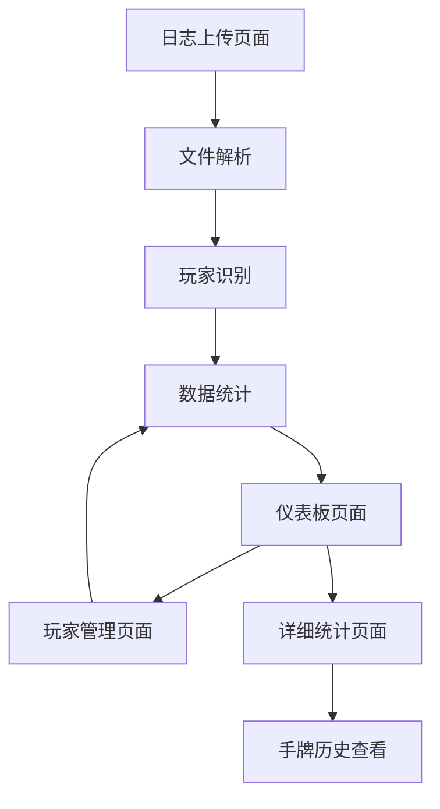

## 1. 产品概述

PokerLogAnalyzer 是一个本地德州扑克日志分析工具，专门用于解析 PokerNow CSV 格式的牌局记录，并提供详细的玩家统计数据和可视化分析。

主要目标：帮助玩家分析自己和他人的游戏风格，通过数据驱动的洞察提升扑克技能。适用于希望深入了解游戏动态、识别玩家倾向并优化策略的德州扑克爱好者。

## 2. 核心功能

### 2.1 用户角色

| 角色 | 注册方式 | 核心权限 |
|------|----------|----------|
| 本地用户 | 无需注册 | 上传日志、查看统计、管理玩家映射 |

### 2.2 功能模块

我们的德州扑克日志分析工具包含以下主要页面：

1. **日志上传页面**：CSV 文件上传、批量处理、进度显示
2. **仪表板页面**：总体统计概览、玩家排名、关键指标图表
3. **玩家管理页面**：玩家映射管理、别名合并、身份识别
4. **详细统计页面**：单个玩家深度分析、多维度数据展示

### 2.3 页面详情

| 页面名称 | 模块名称 | 功能描述 |
|----------|----------|----------|
| 日志上传页面 | 文件上传区域 | 支持拖拽或选择多个 CSV 文件，显示上传进度和处理状态 |
| 日志上传页面 | 日志预览表格 | 显示已上传文件列表，包含文件名、手牌数量、上传时间等信息 |
| 日志上传页面 | 数据处理按钮 | 开始解析日志文件，计算统计数据，支持增量更新 |
| 仪表板页面 | 总体统计卡片 | 显示总手牌数、总玩家数、平均底池大小等核心指标 |
| 仪表板页面 | 玩家排名列表 | 按 VPIP、盈利等维度排序的玩家列表，支持筛选和搜索 |
| 仪表板页面 | 关键指标图表 | VPIP 分布、PFR 趋势、3-bet 频率等可视化图表 |
| 玩家管理页面 | 玩家列表 | 显示所有识别到的玩家及其别名，支持搜索和批量操作 |
| 玩家管理页面 | 映射编辑器 | 将不同 ID 的玩家合并为同一实体，手动编辑玩家信息 |
| 玩家管理页面 | 冲突解决工具 | 自动检测可能的重复玩家，提供智能合并建议 |
| 详细统计页面 | 玩家概览 | 显示选中玩家的基本信息、总体统计数据 |
| 详细统计页面 | 翻前统计面板 | VPIP、PFR、3-bet%、4-bet%、偷盲频率等翻前指标 |
| 详细统计页面 | 翻后统计面板 | C-bet%、弃牌率、转牌持续下注、河牌下注等翻后数据 |
| 详细统计页面 | 位置分析 | 按位置（BTN、CO、MP、UTG、SB、BB）统计的各项指标 |
| 详细统计页面 | 手牌历史 | 显示该玩家的关键手牌记录，支持筛选和回放 |

## 3. 核心流程

### 数据上传和分析流程

1. 用户上传 PokerNow CSV 日志文件
2. 系统解析文件，提取手牌数据和玩家信息
3. 自动识别玩家并检测可能的别名
4. 计算各项统计数据（VPIP、PFR、3-bet 等）
5. 用户可以手动合并玩家身份
6. 生成可视化报告和统计图表

### 玩家映射管理流程

1. 系统自动检测相似玩家名称
2. 用户查看建议的合并列表
3. 手动确认或调整映射关系
4. 更新所有相关统计数据

## 4. 用户界面设计

### 4.1 设计风格

- **主色调**：深绿色（#2D5016）和金色（#D4AF37），体现扑克牌的经典配色
- **辅助色**：深灰色（#2C3E50）和浅灰色（#ECF0F1）用于背景和卡片
- **按钮样式**：圆角矩形，悬停效果，主要操作用金色强调
- **字体**：主要使用 Inter 或 Roboto，标题 18-24px，正文 14-16px
- **布局风格**：卡片式布局，左侧导航，响应式网格系统
- **图标风格**：使用简洁的线性图标，如扑克筹码、纸牌、图表符号

### 4.2 页面设计概述

| 页面名称 | 模块名称 | UI 元素 |
|----------|----------|----------|
| 日志上传页面 | 文件上传区域 | 拖拽区域带虚线边框，上传按钮，进度条显示 |
| 仪表板页面 | 统计卡片 | 圆角卡片，大数字显示，对比箭头图标 |
| 仪表板页面 | 玩家列表 | 表格形式，支持排序，玩家头像占位符 |
| 仪表板页面 | 图表区域 | 柱状图、饼图、折线图，交互式提示框 |
| 玩家管理页面 | 映射界面 | 左右分栏，拖拽合并，颜色编码标识 |
| 详细统计页面 | 统计面板 | 网格布局，环形进度条，对比指标 |

### 4.3 响应式设计

- **桌面优先**：针对 1920x1080 分辨率优化设计
- **移动端适配**：支持平板和手机查看，采用汉堡菜单和垂直滚动
- **触摸优化**：按钮大小适合触摸操作，支持手势滑动切换页面

### 4.4 数据可视化指导

- **图表类型**：VPIP/PFR 散点图、3-bet 频率条形图、位置热力图
- **颜色编码**：红色表示激进，蓝色表示被动，绿色表示中性
- **动画效果**：图表加载动画，数据更新过渡效果
- **交互设计**：悬停显示详细数据，点击钻取更深层分析