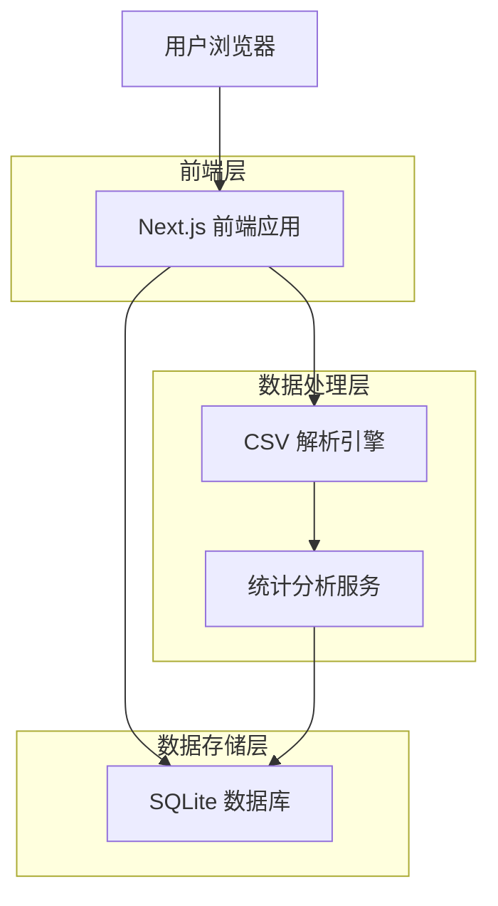
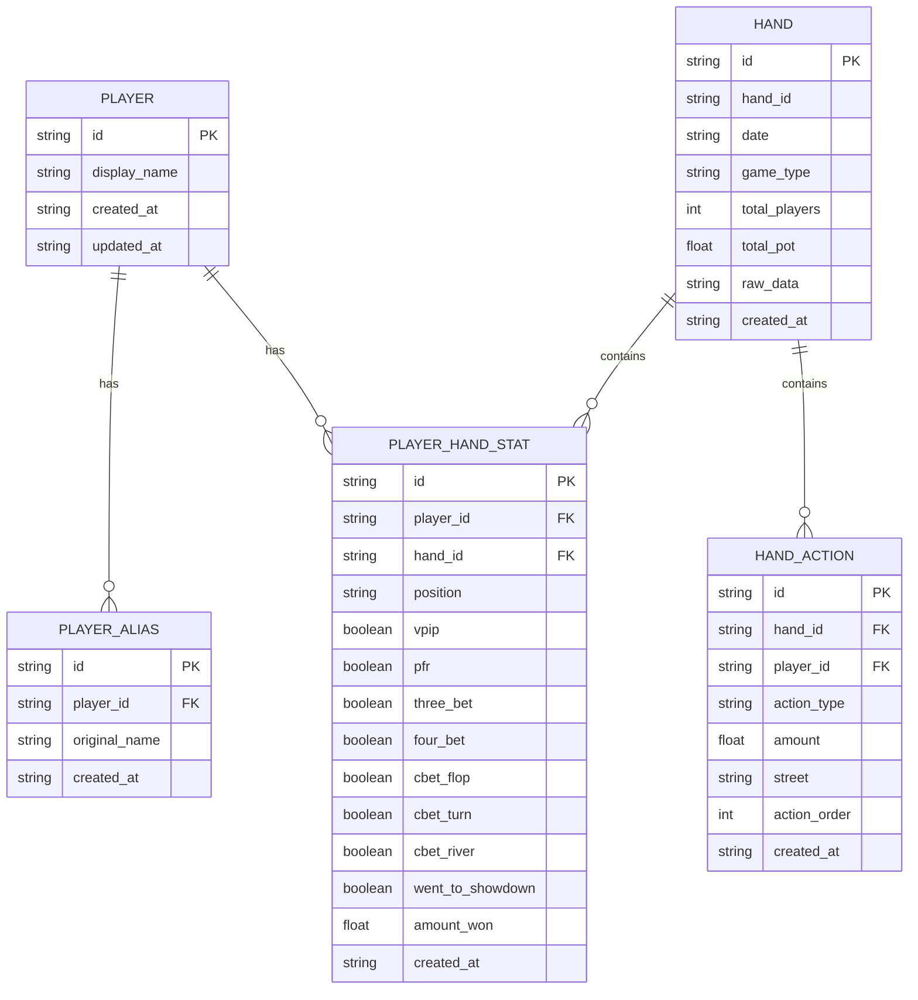
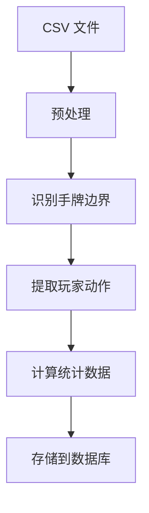

## 1. 架构设计



## 2. 技术描述

- **前端**: Next.js 14 (App Router) + TypeScript + Tailwind CSS
- **初始化工具**: create-next-app
- **数据库**: SQLite (通过 better-sqlite3)
- **数据处理**: PapaParse (CSV 解析) + 自定义统计计算引擎
- **可视化**: Recharts + Chart.js
- **状态管理**: React Context + useReducer
- **文件处理**: FileReader API + 拖拽事件处理

## 3. 路由定义

| 路由 | 用途 |
|-------|---------|
| / | 主页，显示仪表板概览 |
| /upload | 日志上传页面，支持 CSV 文件上传和处理 |
| /players | 玩家管理页面，管理玩家映射和身份 |
| /players/[id] | 玩家详情页面，显示单个玩家的详细统计 |
| /statistics | 综合统计页面，多维度数据分析 |
| /hands | 手牌历史页面，查看具体手牌记录 |

## 4. 核心数据结构

### 4.1 数据库模型



### 4.2 数据库表定义

玩家表 (players)
```sql
CREATE TABLE players (
  id TEXT PRIMARY KEY,
  display_name TEXT NOT NULL,
  created_at DATETIME DEFAULT CURRENT_TIMESTAMP,
  updated_at DATETIME DEFAULT CURRENT_TIMESTAMP
);

CREATE INDEX idx_players_display_name ON players(display_name);
```

玩家别名表 (player_aliases)
```sql
CREATE TABLE player_aliases (
  id TEXT PRIMARY KEY,
  player_id TEXT NOT NULL,
  original_name TEXT NOT NULL,
  created_at DATETIME DEFAULT CURRENT_TIMESTAMP,
  FOREIGN KEY (player_id) REFERENCES players(id),
  UNIQUE(original_name)
);

CREATE INDEX idx_aliases_player_id ON player_aliases(player_id);
CREATE INDEX idx_aliases_original_name ON player_aliases(original_name);
```

手牌表 (hands)
```sql
CREATE TABLE hands (
  id TEXT PRIMARY KEY,
  hand_id TEXT NOT NULL,
  date DATETIME NOT NULL,
  game_type TEXT DEFAULT 'No Limit Texas Hold\'em',
  total_players INTEGER,
  total_pot REAL,
  raw_data TEXT,
  created_at DATETIME DEFAULT CURRENT_TIMESTAMP,
  UNIQUE(hand_id)
);

CREATE INDEX idx_hands_date ON hands(date);
CREATE INDEX idx_hands_hand_id ON hands(hand_id);
```

玩家手牌统计表 (player_hand_stats)
```sql
CREATE TABLE player_hand_stats (
  id TEXT PRIMARY KEY,
  player_id TEXT NOT NULL,
  hand_id TEXT NOT NULL,
  position TEXT,
  vpip BOOLEAN DEFAULT FALSE,
  pfr BOOLEAN DEFAULT FALSE,
  three_bet BOOLEAN DEFAULT FALSE,
  four_bet BOOLEAN DEFAULT FALSE,
  cbet_flop BOOLEAN DEFAULT FALSE,
  cbet_turn BOOLEAN DEFAULT FALSE,
  cbet_river BOOLEAN DEFAULT FALSE,
  went_to_showdown BOOLEAN DEFAULT FALSE,
  amount_won REAL DEFAULT 0,
  created_at DATETIME DEFAULT CURRENT_TIMESTAMP,
  FOREIGN KEY (player_id) REFERENCES players(id),
  FOREIGN KEY (hand_id) REFERENCES hands(id),
  UNIQUE(player_id, hand_id)
);

CREATE INDEX idx_stats_player_id ON player_hand_stats(player_id);
CREATE INDEX idx_stats_hand_id ON player_hand_stats(hand_id);
CREATE INDEX idx_stats_position ON player_hand_stats(position);
```

手牌动作表 (hand_actions)
```sql
CREATE TABLE hand_actions (
  id TEXT PRIMARY KEY,
  hand_id TEXT NOT NULL,
  player_alias TEXT NOT NULL,
  action_type TEXT NOT NULL,
  amount REAL,
  street TEXT NOT NULL,
  action_order INTEGER,
  created_at DATETIME DEFAULT CURRENT_TIMESTAMP,
  FOREIGN KEY (hand_id) REFERENCES hands(id)
);

CREATE INDEX idx_actions_hand_id ON hand_actions(hand_id);
CREATE INDEX idx_actions_player ON hand_actions(player_alias);
CREATE INDEX idx_actions_street ON hand_actions(street);
```

## 5. CSV 解析引擎设计

### 5.1 解析流程



### 5.2 关键正则表达式模式

```typescript
// 手牌开始标识
const HAND_START_PATTERN = /^-- starting hand #\d+ \(id: (\w+)\)\s+(.+) --$/;

// 玩家动作模式
const PLAYER_ACTION_PATTERN = /^"([^"]+)"\s+(posts|folds|calls|raises|bets|checks|shows|collected)\s*(.*)$/;

// 翻牌、转牌、河牌模式
const FLOP_PATTERN = /^Flop:\s+\[(.*)\]$/;
const TURN_PATTERN = /^Turn:\s+\[(.*)\]\s+\[(.*)\]$/;
const RIVER_PATTERN = /^River:\s+\[(.*)\]\s+\[(.*)\]$/;

// 手牌结束标识
const HAND_END_PATTERN = /^-- ending hand #\d+ --$/;
```

### 5.3 统计计算逻辑

```typescript
interface HandStats {
  vpip: boolean;        // 是否自愿投入筹码
  pfr: boolean;         // 是否翻前加注
  threeBet: boolean;    // 是否3-bet
  fourBet: boolean;     // 是否4-bet
  cbetFlop: boolean;    // 是否翻牌持续下注
  cbetTurn: boolean;    // 是否转牌持续下注
  cbetRiver: boolean;   // 是否河牌持续下注
  wentToShowdown: boolean; // 是否进入摊牌
  position: Position;   // 位置
  amountWon: number;    // 赢得金额
}

class StatsCalculator {
  calculatePlayerStats(handActions: Action[]): HandStats {
    // 实现统计计算逻辑
  }
  
  calculateAggregateStats(playerId: string): AggregateStats {
    // 计算聚合统计数据
  }
}
```

## 6. 前端组件架构

### 6.1 核心组件结构

```
src/
├── app/
│   ├── page.tsx              # 主页仪表板
│   ├── upload/page.tsx       # 上传页面
│   ├── players/page.tsx      # 玩家管理
│   ├── players/[id]/page.tsx # 玩家详情
│   └── layout.tsx           # 布局组件
├── components/
│   ├── upload/
│   │   ├── FileUploader.tsx  # 文件上传组件
│   │   └── ProgressBar.tsx   # 进度条组件
│   ├── dashboard/
│   │   ├── StatsCard.tsx     # 统计卡片
│   │   ├── PlayerList.tsx    # 玩家列表
│   │   └── Charts.tsx        # 图表组件
│   ├── players/
│   │   ├── PlayerMapping.tsx # 玩家映射
│   │   └── AliasManager.tsx  # 别名管理
│   └── common/
│       ├── Header.tsx        # 头部导航
│       └── Sidebar.tsx       # 侧边栏
├── lib/
│   ├── database/            # 数据库操作
│   ├── parser/            # CSV 解析器
│   ├── calculator/        # 统计计算器
│   └── utils/             # 工具函数
└── types/                 # TypeScript 类型定义
```

### 6.2 状态管理设计

```typescript
// 全局状态接口
interface AppState {
  players: Player[];
  hands: Hand[];
  uploads: Upload[];
  stats: Statistics;
}

// 动作类型定义
type AppAction = 
  | { type: 'ADD_PLAYERS'; payload: Player[] }
  | { type: 'ADD_HANDS'; payload: Hand[] }
  | { type: 'UPDATE_PLAYER_ALIAS'; payload: { playerId: string; aliases: string[] } }
  | { type: 'SET_STATS'; payload: Statistics };

// Context 提供者
export const AppContext = createContext<{
  state: AppState;
  dispatch: React.Dispatch<AppAction>;
}>({ state: initialState, dispatch: () => null });
```

## 7. 性能优化策略

### 7.1 数据处理优化

- **批量插入**：使用 SQLite 的事务机制批量插入数据
- **索引优化**：为常用查询字段创建索引
- **分页加载**：大量数据采用分页加载和虚拟滚动
- **缓存策略**：计算结果缓存，避免重复计算

### 7.2 前端性能优化

- **组件懒加载**：路由级别的代码分割
- **数据虚拟化**：长列表使用虚拟滚动
- **图表优化**：大数据集使用采样和聚合
- **内存管理**：及时清理不再需要的数据

## 8. 错误处理和日志

### 8.1 错误处理机制

```typescript
class ErrorHandler {
  static handleParseError(error: ParseError): UserFriendlyError {
    // 将解析错误转换为用户友好的错误信息
  }
  
  static handleDatabaseError(error: DatabaseError): UserFriendlyError {
    // 处理数据库错误
  }
  
  static logError(error: Error, context: ErrorContext): void {
    // 记录错误日志用于调试
  }
}
```

### 8.2 用户反馈

- 文件上传进度显示
- 处理状态实时更新
- 错误信息友好提示
- 操作成功确认反馈